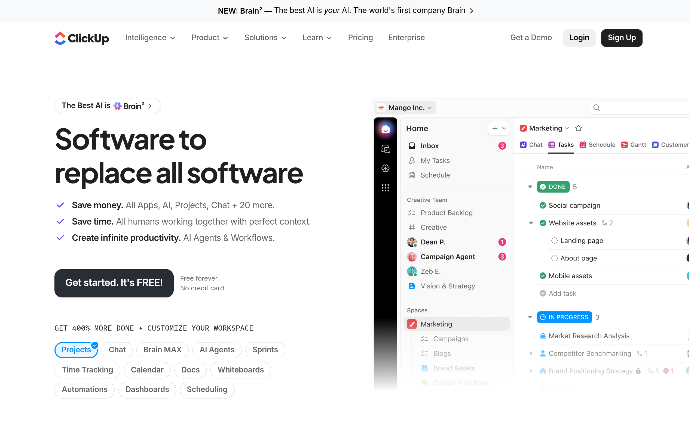

# clickup Design System

You are building UI for **clickup**. Light-themed, neutral palette, sans-serif typography (Plus Jakarta Sans), compact density on a 4px grid, expressive motion.

## Visual Reference

**IMPORTANT**: Study ALL screenshots below before writing any UI. Match colors, typography, spacing, layout, and motion exactly as shown.

### Homepage



> Read `references/DESIGN.md` for full token details.

## Design Philosophy

- **Layered depth** — use shadow tokens to create a sense of physical layering. Each elevation level has a specific shadow.
- **Gradient accents** — gradients are used thoughtfully for emphasis, not decoration.
- **Type pairing** — Plus Jakarta Sans for body/UI text, Inter for headings/display. Never introduce a third typeface.
- **compact density** — 4px base grid. Every dimension is a multiple of 4.
- **neutral palette** — the color temperature runs neutral, matching the sans-serif typography.
- **Expressive motion** — animations are an integral part of the experience. Use spring physics and layout animations.

## Color System

### Core Palette

| Role | Token | Hex | Use |
|------|-------|-----|-----|
| Background | `--background` | `#ffffff` | Page/app background |
| Surface | `--surface` | `#f1f3fb` | Cards, panels, modals |
| Text Primary | `--text-primary` | `#030303` | Headings, body text |
| Text Muted | `--text-muted` | `#646464` | Captions, placeholders |
| Border | `--border` | `#1d1e20` | Dividers, card borders |

### Status Colors

| Status | Hex | Use |
|--------|-----|-----|
| Danger | `#fd9a46` | Errors, destructive actions |

### Extended Palette

- **shimmer-color1:** `#0091ff`
- **bottom-navigation-mobile-border-color:** `#e8e8e8` — Light surface or highlight color
- **bottom-navigation-chevron-color:** `#838383`
- **bottom-navigation-shell-background:** `#111111` — Deep background layer or shadow color
- **Core-Text-Disabled:** `#bbbbbb`
- **Core-Accents-Purple:** `#6647f0`
- **color-primary-purple:** `#7612fa`
- **Carousel-Control-Background-Hover:** `#e2e8ff` — Light surface or highlight color

### CSS Variable Tokens

```css
--color-button-other-background: 0,0,0,.15;
--color-gradient-cyan-accent-light-1: var(--color-white),.1;
--color-ui-border-default: rgba(96,96,163,.3);
--color-ui-border-hover: rgba(96,96,163,.5);
--color-ui-border-buttons: rgba(0,0,0,.18);
--color-ui-border-default: rgba(115,115,115,.3);
--color-ui-border-hover: rgba(115,115,115,.5);
--color-ui-border-buttons: rgba(255,255,255,.18);
--max-card-width: 545px;
--accent-inline-property: 40px;
--table-border-radius: 10px;
--table-border-radius: 14px;
--accent-inline-property: 40px;
--bottom-navigation-shell-background: rgb(var(--color-white));
--bottom-navigation-shell-background: #111;
--bottom-navigation-link-hover-background: rgba(0,0,0,.04);
--bottom-navigation-mobile-border-color: rgb(232,232,232);
--bottom-navigation-subsection-border-color: rgb(232,232,232);
--bottom-navigation-link-hover-background: rgba(255,255,255,.04);
--bottom-navigation-mobile-border-color: rgba(255,255,255,.12);
```

## Typography

### Font Stack

- **Plus Jakarta Sans** — Heading 1, Heading 2, Heading 3
- **Inter** — Body, Caption
- **Sometype Mono** — Code

### Font Sources

```css
@font-face {
  font-family: "Inter";
  src: url("fonts/Inter-Bold.ttf") format("truetype");
  font-weight: 700;
}
@font-face {
  font-family: "Inter";
  src: url("fonts/Inter-Regular.ttf") format("truetype");
  font-weight: 400;
}
@font-face {
  font-family: "Plus Jakarta Sans";
  src: url("fonts/PlusJakartaSans-Bold.ttf") format("truetype");
  font-weight: 700;
}
@font-face {
  font-family: "Plus Jakarta Sans";
  src: url("fonts/PlusJakartaSans-Regular.ttf") format("truetype");
  font-weight: 400;
}
@font-face {
  font-family: "Shantell Sans";
  src: url("fonts/ShantellSans-Bold.ttf") format("truetype");
  font-weight: 700;
}
@font-face {
  font-family: "Shantell Sans";
  src: url("fonts/ShantellSans-Regular.ttf") format("truetype");
  font-weight: 400;
}
@font-face {
  font-family: "Sometype Mono";
  src: url("fonts/SometypeMono-Bold.ttf") format("truetype");
  font-weight: 700;
}
@font-face {
  font-family: "Sometype Mono";
  src: url("fonts/SometypeMono-Regular.ttf") format("truetype");
  font-weight: 400;
}
```

### Type Scale

| Role | Family | Size | Weight |
|------|--------|------|--------|
| Heading 1 | Plus Jakarta Sans | 236px | 700 |
| Heading 2 | Plus Jakarta Sans | 166px | 700 |
| Heading 3 | Plus Jakarta Sans | 5.75rem | 700 |
| Body | Inter | 14px | 400 |
| Caption | Inter | 16px | 400 |
| Code | Sometype Mono | 14px | 400 |

### Typography Rules

- Body/UI: **Plus Jakarta Sans**, Headings: **Inter** — these are the only display fonts
- Max 3-4 font sizes per screen
- Headings: weight 600-700, body: weight 400
- Use color and opacity for text hierarchy, not additional font sizes
- Line height: 1.5 for body, 1.2 for headings

## Spacing & Layout

### Base Grid: 4px

Every dimension (margin, padding, gap, width, height) must be a multiple of **4px**.

### Spacing Scale

`2, 4, 6, 8, 10, 12, 14, 16, 18, 20, 22, 24` px

### Spacing as Meaning

| Spacing | Use |
|---------|-----|
| 4-8px | Tight: related items (icon + label, avatar + name) |
| 12-16px | Medium: between groups within a section |
| 24-32px | Wide: between distinct sections |
| 48px+ | Vast: major page section breaks |

### Border Radius

Scale: `.125rem, .188rem, .25rem, .375rem, .5rem, 1px, 2px, 3px, 4px, 5px, 6px, 7px, 7.7px, 8px, 9px, 10px, 11px, 12px, 13px, 14px, 15px, 16px, 18px, 20px, 24px, 25px, 27.72px, 28px, 30px, 32px, 40px, 48px, 50px, 54px, 60px, 64.605px, 70px, 88px, 90.324px, 100px, 200px, unset, 100%, 124.516px, 170px, 724px, 999px, inherit`
Default: `24px`

### Container

Max-width: `1200px`, centered with auto margins.

### Breakpoints

| Name | Value |
|------|-------|
| xs | 25rem |
| sm | 31.25rem |
| sm | 37.5rem |
| md | 48rem |
| lg | 51.3125rem |
| lg | 56.25rem |
| lg | 62.5rem |
| xl | 68.75rem |
| xl | 70rem |
| xl | 72.5rem |
| xl | 75rem |
| 2xl | 87.5rem |
| 2xl | 106.25rem |
| xs | 300px |
| xs | 395px |
| xs | 400px |
| xs | 480px |
| sm | 500px |
| sm | 520px |
| sm | 560px |
| sm | 600px |
| sm | 640px |
| md | 650px |
| md | 670px |
| md | 678px |
| md | 700px |
| md | 760px |
| md | 768px |
| lg | 820px |
| lg | 860px |
| lg | 900px |
| lg | 901px |
| lg | 968px |
| lg | 980px |
| lg | 981px |
| lg | 991px |
| lg | 1000px |
| lg | 1024px |
| xl | 1025px |
| xl | 1080px |
| xl | 1081px |
| xl | 1100px |
| xl | 1119px |
| xl | 1160px |
| xl | 1180px |
| xl | 1200px |
| xl | 1250px |
| 2xl | 1400px |
| 2xl | 1440px |

Mobile-first: design for small screens, layer on responsive overrides.

## Component Patterns

### Card

```css
.card {
  background: #f1f3fb;
  border: 1px solid #1d1e20;
  border-radius: 24px;
  padding: 16px;
  box-shadow: 0 3px 3px -1.5px #122ba50d;
}
```

```html
<div class="card">
  <h3>Card Title</h3>
  <p>Card content goes here.</p>
</div>
```

### Button

```css
/* Primary */
.btn-primary {
  background: #cccccc;
  color: #030303;
  border-radius: 24px;
  padding: 8px 16px;
  font-weight: 500;
  transition: opacity 150ms ease;
}
.btn-primary:hover { opacity: 0.9; }

/* Ghost */
.btn-ghost {
  background: transparent;
  border: 1px solid #1d1e20;
  color: #030303;
  border-radius: 24px;
  padding: 8px 16px;
}
```

```html
<button class="btn-primary">Get Started</button>
<button class="btn-ghost">Learn More</button>
```

### Input

```css
.input {
  background: #ffffff;
  border: 1px solid #1d1e20;
  border-radius: 24px;
  padding: 8px 12px;
  color: #030303;
  font-size: 14px;
}
.input:focus { border-color: var(--accent); outline: none; }
```

```html
<input class="input" type="text" placeholder="Search..." />
```

### Badge / Chip

```css
.badge {
  display: inline-flex;
  align-items: center;
  padding: 4px 8px;
  border-radius: 9999px;
  font-size: 12px;
  font-weight: 500;
  background: #f1f3fb;
  color: #646464;
}
```

```html
<span class="badge">New</span>
<span class="badge">Beta</span>
```

### Modal / Dialog

```css
.modal-backdrop { background: rgba(0, 0, 0, 0.6); }
.modal {
  background: #f1f3fb;
  border: 1px solid #1d1e20;
  border-radius: inherit;
  padding: 24px;
  max-width: 480px;
  width: 90vw;
  box-shadow: 0 1px 1px -.5px #122ba50a,0 3px 3px -1.5px #122ba50a,0 6px 6px -3px #122ba50a,0 12px 12px -6px #122ba50a;
}
```

```html
<div class="modal-backdrop">
  <div class="modal">
    <h2>Dialog Title</h2>
    <p>Dialog content.</p>
    <button class="btn-primary">Confirm</button>
    <button class="btn-ghost">Cancel</button>
  </div>
</div>
```

### Table

```css
.table { width: 100%; border-collapse: collapse; }
.table th {
  text-align: left;
  padding: 8px 12px;
  font-weight: 500;
  font-size: 12px;
  color: #646464;
  text-transform: uppercase;
  letter-spacing: 0.05em;
  border-bottom: 1px solid #1d1e20;
}
.table td {
  padding: 12px;
  border-bottom: 1px solid #1d1e20;
}
```

```html
<table class="table">
  <thead><tr><th>Name</th><th>Status</th><th>Date</th></tr></thead>
  <tbody>
    <tr><td>Item One</td><td>Active</td><td>Jan 1</td></tr>
    <tr><td>Item Two</td><td>Pending</td><td>Jan 2</td></tr>
  </tbody>
</table>
```

### Navigation

```css
.nav {
  display: flex;
  align-items: center;
  gap: 8px;
  padding: 12px 16px;
  border-bottom: 1px solid #1d1e20;
}
.nav-link {
  color: #646464;
  padding: 8px 12px;
  border-radius: 24px;
  transition: color 150ms;
}
.nav-link:hover { color: #030303; }
```

```html
<nav class="nav">
  <a href="/" class="nav-link active">Home</a>
  <a href="/about" class="nav-link">About</a>
  <a href="/pricing" class="nav-link">Pricing</a>
  <button class="btn-primary" style="margin-left: auto">Get Started</button>
</nav>
```

### Extracted Components

These components were found in the codebase:

**Button** (`html`)

**Navigation** (`html`)

## Page Structure

The following page sections were detected:

- **Navigation** — Top navigation bar (4 items)
- **Hero** — Hero/banner section with headline and CTAs
- **Footer** — Page footer with links and info (4 items)
- **Faq** — FAQ/accordion section

When building pages, follow this section order and structure.

## Animation & Motion

This project uses **expressive motion**. Animations are part of the design language.

### CSS Animations

- `_progressBarHeight_1kq03_1`
- `_slideDown_1kq03_1`
- `_slideUp_1kq03_1`
- `_slideDown_jxed5_1`
- `_slideUp_jxed5_1`

### Motion Tokens

- **Duration scale:** `0ms`, `.001ms`, `.01ms`, `.18s`, `.2s`, `.25s`, `.3s`, `6s`, `47s`, `52s`, `54s`, `58s`, `61s`, `80ms`, `100ms`, `150ms`, `160ms`, `180ms`, `200ms`, `220ms`, `250ms`, `280ms`, `300ms`, `360ms`, `400ms`, `420ms`, `450ms`, `480ms`, `500ms`, `600ms`, `640ms`, `680ms`, `700ms`, `760ms`, `800ms`, `950ms`, `1200ms`, `1400ms`, `2000ms`, `3000ms`, `12000ms`
- **Easing functions:** `ease`, `cubic-bezier(.4,0,.2,1)`, `ease-in-out`, `ease-out`, `cubic-bezier(.25,.46,.45,.94)`, `cubic-bezier(.33,1,.68,1)`, `cubic-bezier(.2,0,.2,1)`, `cubic-bezier(.68,-.55,.265,1.55)`, `cubic-bezier(.87,0,.13,1)`, `linear`, `cubic-bezier(.215,.61,.355,1)`, `cubic-bezier(.34,1.56,.64,1)`, `cubic-bezier(.22,1,.36,1)`, `cubic-bezier(.33,0,.2,1)`, `cubic-bezier(.22,.9,.3,1)`, `cubic-bezier(.22,.9,.3,1.05)`

### Motion Guidelines

- **Duration:** Use values from the duration scale above. Short (0ms) for micro-interactions, long (12000ms) for page transitions
- **Easing:** Use `ease` as the default easing curve
- **Direction:** Elements enter from bottom/right, exit to top/left
- **Reduced motion:** Always respect `prefers-reduced-motion` — disable animations when set

## Depth & Elevation

### Shadow Tokens

- Subtle: `0 0#0000,0 1px 2px #0000000d`
- Subtle: `inset 0 0 0 1px #00000026`
- Subtle: `inset 0 0 0 1px #dacfff`
- Subtle: `0 0 0 1px #0000001a`
- Subtle: `0 1.679px 1.679px #fffc`
- Subtle: `0 0 0 1px rgba(var(--pill-ring-color),var(--pill-ring-opacity))`

### Z-Index Scale

`0, 1, 2, 3, 4, 5, 6, 7, 8, 9, 10, 11, 20, 21, 22, 50, 89, 99, 100, 1001, 1999, 9997, 9998, 9999, 10000, 10020, 50000, 99999, 2147483647, 3000000000, 3000000001, 3000000002, 3000000003`

Use these exact values — never invent z-index values.

## Anti-Patterns (Never Do)

- **No blur effects** — no backdrop-blur, no filter: blur()
- **No zebra striping** — tables and lists use borders for separation
- **No invented colors** — every hex value must come from the palette above
- **No arbitrary spacing** — every dimension is a multiple of 4px
- **No extra fonts** — only Plus Jakarta Sans and Inter and Sometype Mono are allowed
- **No arbitrary border-radius** — use the scale: .125rem, .188rem, .25rem, .375rem, .5rem, 1px, 2px, 3px, 4px, 5px
- **No opacity for disabled states** — use muted colors instead

## Workflow

1. **Read** `references/DESIGN.md` before writing any UI code
2. **Pick colors** from the Color System section — never invent new ones
3. **Set typography** — Plus Jakarta Sans, Inter, Sometype Mono only, using the type scale
4. **Build layout** on the 4px grid — check every margin, padding, gap
5. **Match components** to patterns above before creating new ones
6. **Apply elevation** — use shadow tokens
7. **Validate** — every value traces back to a design token. No magic numbers.

## Brand Spec

- **Favicon:** `/favicons/apple-touch-icon.png`
- **Site URL:** `https://clickup.com`
- **Brand typeface:** Plus Jakarta Sans

## Quick Reference

```
Background:     #ffffff
Surface:        #f1f3fb
Text:           #030303 / #646464
Accent:         (not extracted)
Border:         #1d1e20
Font:           Plus Jakarta Sans
Spacing:        4px grid
Radius:         24px
Components:     6 detected
```

## When to Trigger

Activate this skill when:
- Creating new components, pages, or visual elements for clickup
- Writing CSS, Tailwind classes, styled-components, or inline styles
- Building page layouts, templates, or responsive designs
- Reviewing UI code for design consistency
- The user mentions "clickup" design, style, UI, or theme
- Generating mockups, wireframes, or visual prototypes

---

# Full Reference Files

> Every output file is embedded below. Claude has full design system context from /skills alone.

## Design System Tokens (DESIGN.md)

# clickup DESIGN.md

> Auto-generated design system — reverse-engineered via static analysis by skillui.
> Frameworks: None detected
> Colors: 20 · Fonts: 3 · Components: 6
> Icon library: not detected · State: not detected
> Primary theme: light · Dark mode toggle: no · Motion: expressive

## Visual Reference

**Match this design exactly** — study colors, fonts, spacing, and component shapes before writing any UI code.


---

## 1. Visual Theme & Atmosphere

This is a **light-themed** interface with a neutral, approachable feel. The light background emphasizes content clarity. Typography pairs **Inter** for display/headings with **Plus Jakarta Sans** for body text, creating clear visual hierarchy through type contrast. Spacing follows a **4px base grid** (compact density), with scale: 2, 4, 6, 8, 10, 12, 14, 16px. Motion is expressive — spring physics, layout animations, and staggered reveals are part of the visual language.

---

## 2. Color Palette & Roles

| Token | Hex | Role | Use |
|---|---|---|---|
| color-ui-glass-main | `#ffffff` | background | Page background, darkest surface |
| color-gray-light-2 | `#f1f3fb` | surface | Card and panel backgrounds |
| color-ui-border-buttons | `#030303` | text-primary | Headings and body text |
| bottom-navigation-item-text-color | `#646464` | text-muted | Captions, placeholders, secondary info |
| Hero-Text-Secondary | `#5d5d85` | text-muted | Captions, placeholders, secondary info |
| color-ui-glass-main | `#1d1e20` | border | Dividers, card borders, outlines |
| danger | `#fd9a46` | danger | Error states, destructive actions |
| shimmer-color1 | `#0091ff` | info | Informational highlights |
| bottom-navigation-mobile-border-color | `#e8e8e8` | unknown | Palette color |
| bottom-navigation-chevron-color | `#838383` | unknown | Palette color |
| bottom-navigation-shell-background | `#111111` | unknown | Palette color |
| Core-Text-Disabled | `#bbbbbb` | unknown | Palette color |
| Core-Accents-Purple | `#6647f0` | unknown | Palette color |
| color-primary-purple | `#7612fa` | unknown | Palette color |
| Carousel-Control-Background-Hover | `#e2e8ff` | unknown | Palette color |
| color-slate-900 | `#292d34` | unknown | Palette color |
| Core-Button-Secondary-Hover | `#d9d9d9` | unknown | Palette color |
| unknown | `#fa24ce` | unknown | Palette color |
| unknown | `#fc6d7b` | unknown | Palette color |
| color-ui-border-default | `#737373` | unknown | Palette color |

### CSS Variable Tokens

```css
--color-button-other-background: 0,0,0,.15;
--color-gradient-cyan-accent-light-1: var(--color-white),.1;
--color-ui-border-default: rgba(96,96,163,.3);
--color-ui-border-hover: rgba(96,96,163,.5);
--color-ui-border-buttons: rgba(0,0,0,.18);
--color-ui-border-default: rgba(115,115,115,.3);
--color-ui-border-hover: rgba(115,115,115,.5);
--color-ui-border-buttons: rgba(255,255,255,.18);
--max-card-width: 545px;
--accent-inline-property: 40px;
--table-border-radius: 10px;
--table-border-radius: 14px;
--accent-inline-property: 40px;
--bottom-navigation-shell-background: rgb(var(--color-white));
--bottom-navigation-shell-background: #111;
--bottom-navigation-link-hover-background: rgba(0,0,0,.04);
--bottom-navigation-mobile-border-color: rgb(232,232,232);
--bottom-navigation-subsection-border-color: rgb(232,232,232);
--bottom-navigation-link-hover-background: rgba(255,255,255,.04);
--bottom-navigation-mobile-border-color: rgba(255,255,255,.12);
```


---

## 3. Typography Rules

**Font Stack:**
- **Plus Jakarta Sans** — Heading 1, Heading 2, Heading 3
- **Inter** — Body, Caption
- **Sometype Mono** — Code

**Font Sources:**

```css
@font-face {
  font-family: "Inter";
  src: url("fonts/Inter-Bold.ttf") format("truetype");
  font-weight: 700;
}
@font-face {
  font-family: "Inter";
  src: url("fonts/Inter-Regular.ttf") format("truetype");
  font-weight: 400;
}
@font-face {
  font-family: "Plus Jakarta Sans";
  src: url("fonts/PlusJakartaSans-Bold.ttf") format("truetype");
  font-weight: 700;
}
@font-face {
  font-family: "Plus Jakarta Sans";
  src: url("fonts/PlusJakartaSans-Regular.ttf") format("truetype");
  font-weight: 400;
}
@font-face {
  font-family: "Shantell Sans";
  src: url("fonts/ShantellSans-Bold.ttf") format("truetype");
  font-weight: 700;
}
@font-face {
  font-family: "Shantell Sans";
  src: url("fonts/ShantellSans-Regular.ttf") format("truetype");
  font-weight: 400;
}
@font-face {
  font-family: "Sometype Mono";
  src: url("fonts/SometypeMono-Bold.ttf") format("truetype");
  font-weight: 700;
}
@font-face {
  font-family: "Sometype Mono";
  src: url("fonts/SometypeMono-Regular.ttf") format("truetype");
  font-weight: 400;
}
```

| Role | Font | Size | Weight |
|---|---|---|---|
| Heading 1 | Plus Jakarta Sans | 236px | 700 |
| Heading 2 | Plus Jakarta Sans | 166px | 700 |
| Heading 3 | Plus Jakarta Sans | 5.75rem | 700 |
| Body | Inter | 14px | 400 |
| Caption | Inter | 16px | 400 |
| Code | Sometype Mono | 14px | 400 |

**Typographic Rules:**
- Limit to 3 font families max per screen
- Use **Plus Jakarta Sans** for body/UI text, **Inter** for display/headings
- Maintain consistent hierarchy: no more than 3-4 font sizes per screen
- Headings use bold (600-700), body uses regular (400)
- Line height: 1.5 for body text, 1.2 for headings
- Use color and opacity for secondary hierarchy, not additional font sizes


---

## 4. Component Stylings

### Layout (1)

**Footer** — `html`

### Navigation (1)

**Navigation** — `html`

### Data Input (1)

**Button** — `html`
- Animation: 

### Media (3)

**Image** — `html`

**Icon** — `html`

**Map/Canvas** — `html`


---

## 5. Layout Principles

- **Base spacing unit:** 4px
- **Spacing scale:** 2, 4, 6, 8, 10, 12, 14, 16, 18, 20, 22, 24
- **Border radius:** .125rem, .188rem, .25rem, .375rem, .5rem, 1px, 2px, 3px, 4px, 5px, 6px, 7px, 7.7px, 8px, 9px, 10px, 11px, 12px, 13px, 14px, 15px, 16px, 18px, 20px, 24px, 25px, 27.72px, 28px, 30px, 32px, 40px, 48px, 50px, 54px, 60px, 64.605px, 70px, 88px, 90.324px, 100px, 200px, unset, 100%, 124.516px, 170px, 724px, 999px, inherit
- **Max content width:** 1200px

**Spacing as Meaning:**
| Spacing | Use |
|---|---|
| 4-8px | Tight: related items within a group |
| 12-16px | Medium: between groups |
| 24-32px | Wide: between sections |
| 48px+ | Vast: major section breaks |


---

## 6. Depth & Elevation

### Flat — subtle depth hints

- `0 0#0000,0 1px 2px #0000000d`
- `inset 0 0 0 1px #00000026`
- `inset 0 0 0 1px #dacfff`

### Raised — cards, buttons, interactive elements

- `0 3px 3px -1.5px #122ba50d`
- `0 2px 8px #0000001a`
- `0 1px 4px #00000014`

### Floating — dropdowns, popovers, modals

- `0 1px 1px -.5px #122ba50a,0 3px 3px -1.5px #122ba50a,0 6px 6px -3px #122ba50a,0 12px 12px -6px #122ba50a`
- `0 4px 12px #0000001a`
- `0 4px 10px #0d15300d`

### Overlay — full-screen overlays, top-level dialogs

- `0 1px 1px -.5px #122ba50a,0 3px 3px -1.5px #122ba50a,0 6px 6px -3px #122ba50a,0 12px 12px -6px #122ba50a,0 24px 24px -12px #122ba50a`
- `0 1px 1px -.5px #122ba50f,0 3px 3px -1.5px #122ba50f,0 6px 6px -3px #122ba50f,0 12px 12px -6px #122ba50f,0 24px 24px -12px #122ba50f,0 48px 48px -24px #122ba50f`
- `0 .41px .41px -.205px #122ba50a,0 1.231px 1.231px -.616px #122ba50a,0 2.462px 2.462px -1.231px #122ba50a`

### Z-Index Scale

`0, 1, 2, 3, 4, 5, 6, 7, 8, 9, 10, 11, 20, 21, 22, 50, 89, 99, 100, 1001, 1999, 9997, 9998, 9999, 10000, 10020, 50000, 99999, 2147483647, 3000000000, 3000000001, 3000000002, 3000000003`


---

## 7. Animation & Motion

This project uses **expressive motion**. Animations are an integral part of the experience.

### CSS Animations

- `@keyframes _progressBarHeight_1kq03_1`
- `@keyframes _slideDown_1kq03_1`
- `@keyframes _slideUp_1kq03_1`
- `@keyframes _slideDown_jxed5_1`
- `@keyframes _slideUp_jxed5_1`
- `@keyframes _banner_10pd0_1`
- `@keyframes _moveLogos_1ojqd_1`
- `@keyframes _slide-translate_1s4xh_1`

### Animated Components

- **Button**: 

### Motion Guidelines

- Duration: 150-300ms for micro-interactions, 300-500ms for page transitions
- Easing: `ease-out` for enters, `ease-in` for exits
- Always respect `prefers-reduced-motion`


---

## 8. Do's and Don'ts

### Do's

- Use `#ffffff` as the primary page background
- Pair **Plus Jakarta Sans** (body) with **Inter** (display) — these are the only allowed fonts
- Follow the **4px** spacing grid for all margins, padding, and gaps
- Use the defined shadow tokens for elevation — see Section 6
- Use border-radius from the scale: .125rem, .188rem, .25rem, .375rem, .5rem
- Reuse existing components from Section 4 before creating new ones

### Don'ts

- Don't introduce colors outside this palette — extend the design tokens first
- Don't introduce additional font families beyond Plus Jakarta Sans and Inter and Sometype Mono
- Don't use arbitrary spacing values — stick to multiples of 4px
- Don't create custom box-shadow values outside the system tokens
- Don't use arbitrary border-radius values — pick from the defined scale
- Don't duplicate component patterns — check Section 4 first
- Don't use backdrop-blur or blur effects

### Anti-Patterns (detected from codebase)

- No blur or backdrop-blur effects
- No zebra striping on tables/lists


---

## 9. Responsive Behavior

| Name | Value | Source |
|---|---|---|
| xs | 25rem | css |
| sm | 31.25rem | css |
| sm | 37.5rem | css |
| md | 48rem | css |
| lg | 51.3125rem | css |
| lg | 56.25rem | css |
| lg | 62.5rem | css |
| xl | 68.75rem | css |
| xl | 70rem | css |
| xl | 72.5rem | css |
| xl | 75rem | css |
| 2xl | 87.5rem | css |
| 2xl | 106.25rem | css |
| xs | 300px | css |
| xs | 395px | css |
| xs | 400px | css |
| xs | 480px | css |
| sm | 500px | css |
| sm | 520px | css |
| sm | 560px | css |
| sm | 600px | css |
| sm | 640px | css |
| md | 650px | css |
| md | 670px | css |
| md | 678px | css |
| md | 700px | css |
| md | 760px | css |
| md | 768px | css |
| lg | 820px | css |
| lg | 860px | css |
| lg | 900px | css |
| lg | 901px | css |
| lg | 968px | css |
| lg | 980px | css |
| lg | 981px | css |
| lg | 991px | css |
| lg | 1000px | css |
| lg | 1024px | css |
| xl | 1025px | css |
| xl | 1080px | css |
| xl | 1081px | css |
| xl | 1100px | css |
| xl | 1119px | css |
| xl | 1160px | css |
| xl | 1180px | css |
| xl | 1200px | css |
| xl | 1250px | css |
| 2xl | 1400px | css |
| 2xl | 1440px | css |

**Approach:** Use `@media (min-width: ...)` queries matching the breakpoints above.


---

## 10. Agent Prompt Guide

Use these as starting points when building new UI:

### Build a Card

```
Background: #f1f3fb
Border: 1px solid #1d1e20
Radius: 24px
Padding: 16px
Font: Plus Jakarta Sans
Use shadow tokens from Section 6.
```

### Build a Button

```
Primary: bg var(--accent), text white
Ghost: bg transparent, border #1d1e20
Padding: 8px 16px
Radius: 24px
Hover: opacity 0.9 or lighter shade
Focus: ring with var(--accent)
```

### Build a Page Layout

```
Background: #ffffff
Max-width: 1200px, centered
Grid: 4px base
Responsive: mobile-first, breakpoints from Section 9
```

### Build a Stats Card

```
Surface: #f1f3fb
Label: #646464 (muted, 12px, uppercase)
Value: #030303 (primary, 24-32px, bold)
Status: use success/warning/danger from Section 2
```

### Build a Form

```
Input bg: #ffffff
Input border: 1px solid #1d1e20
Focus: border-color var(--accent)
Label: #646464 12px
Spacing: 16px between fields
Radius: 24px
```

### General Component

```
1. Read DESIGN.md Sections 2-6 for tokens
2. Colors: only from palette
3. Font: Plus Jakarta Sans, type scale from Section 3
4. Spacing: 4px grid
5. Components: match patterns from Section 4
6. Elevation: shadow tokens
```

## Bundled Fonts (fonts/)

The following font files are bundled in the `fonts/` directory:

- `fonts/Inter-Black.ttf`
- `fonts/Inter-Bold.ttf`
- `fonts/Inter-ExtraBold.ttf`
- `fonts/Inter-ExtraLight.ttf`
- `fonts/Inter-Light.ttf`
- `fonts/Inter-Medium.ttf`
- `fonts/Inter-Regular.ttf`
- `fonts/Inter-SemiBold.ttf`
- `fonts/Inter-Thin.ttf`
- `fonts/PlusJakartaSans-Bold.ttf`
- `fonts/PlusJakartaSans-ExtraBold.ttf`
- `fonts/PlusJakartaSans-ExtraLight.ttf`
- `fonts/PlusJakartaSans-Light.ttf`
- `fonts/PlusJakartaSans-Medium.ttf`
- `fonts/PlusJakartaSans-Regular.ttf`
- `fonts/PlusJakartaSans-SemiBold.ttf`
- `fonts/ShantellSans-Bold.ttf`
- `fonts/ShantellSans-ExtraBold.ttf`
- `fonts/ShantellSans-Light.ttf`
- `fonts/ShantellSans-Medium.ttf`
- `fonts/ShantellSans-Regular.ttf`
- `fonts/ShantellSans-SemiBold.ttf`
- `fonts/SometypeMono-Bold.ttf`
- `fonts/SometypeMono-Medium.ttf`
- `fonts/SometypeMono-Regular.ttf`
- `fonts/SometypeMono-SemiBold.ttf`

Use these local font files in `@font-face` declarations instead of fetching from Google Fonts.

## Homepage Screenshots (screenshots/)


