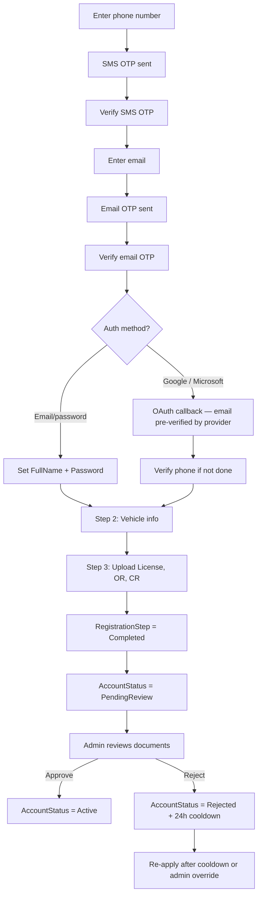
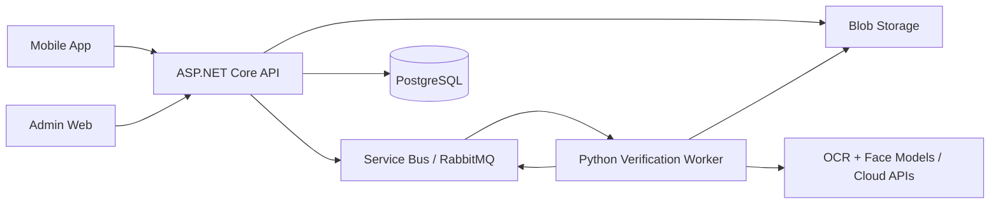

# AimPark Registration & Login Enhancement Plan

> **Status:** Planning document — not yet implemented  
> **Last updated:** June 2026  
> **Scope:** Mobile app (user registration) + Web app (admin)

This document captures product decisions, use cases, and implementation guidance for enhancing the AimPark registration and login flow. It builds on the existing `AimPark.API` project structure and the code review findings from the initial auth implementation.

---

## Table of Contents

1. [Executive Summary](#executive-summary)
2. [Locked-In Product Decisions](#locked-in-product-decisions)
3. [Status Model](#status-model)
4. [Registration Flow (Phase 1)](#registration-flow-phase-1)
5. [Authentication Methods](#authentication-methods)
6. [Rejected Users & Re-Apply Policy](#rejected-users--re-apply-policy)
7. [Admin Override](#admin-override)
8. [Login Behavior](#login-behavior)
9. [Use Case Matrix](#use-case-matrix)
10. [API Endpoints](#api-endpoints)
11. [Project Structure](#project-structure)
12. [Entity & Schema Changes](#entity--schema-changes)
13. [Implementation Phases](#implementation-phases)
14. [Phase 2: Face & Document Verification (Deferred)](#phase-2-face--document-verification-deferred)
15. [Security & Production Notes](#security--production-notes)
16. [Open Items](#open-items)

---

## Executive Summary

The current registration flow is a 3-step wizard (`register` → `register/vehicle` → `register/documents`) with a single `UserStatus.Incomplete` state and manual admin approval after submission.

The enhanced flow adds:

- **Required phone verification** (SMS OTP) — primary channel for the mobile app
- **Required email verification** (email OTP) — double authentication in step 1
- **OAuth registration** via Google and Microsoft
- **Clearer status model** — separate registration progress from account lifecycle
- **Rejected user policy** — retain records, 24-hour re-apply cooldown, admin can override
- **Admin manual review** of uploaded documents (Phase 1)
- **Automated face/document verification** — deferred to Phase 2

Phase 1 delivers a production-viable registration system. Phase 2 adds automation via an internal verification worker when volume or fraud risk justifies it.

---

## Locked-In Product Decisions

| Decision | Choice | Notes |
|----------|--------|-------|
| Auto-approve after verification | **Phase 2 only** | Phase 1 uses manual admin review |
| Admin manual override | **Yes, always** | Approve, reject, reset re-apply, reset registration step |
| Re-apply cooldown after rejection | **24 hours** | Admin can override to allow immediate re-apply |
| Keep rejected email/phone in DB | **Yes** | No hard delete; controlled re-apply on same row |
| Phone number | **Required** | Mobile-first; SMS OTP for verification |
| Email | **Required + verified** | Email OTP in step 1; also used for admin/OAuth |
| OAuth (Google / Microsoft) | **Yes** | Phone SMS verification still required on mobile |
| Face/document automation | **Deferred (Phase 2)** | Manual admin review after document upload for now |
| `Incomplete` status | **Remove** | Replace with `RegistrationStep` + `AccountStatus` |

---

## Status Model

`Incomplete` is too vague — a user can be incomplete at step 2, 3, or awaiting verification. Use **two separate concepts**.

### RegistrationStep — where the user is in the wizard

| Value | Meaning |
|-------|---------|
| `PhoneVerification` | Phone entered, SMS OTP not yet verified |
| `EmailVerification` | Phone verified, email OTP not yet verified |
| `ProfileSetup` | Email verified; user must set name/password (skipped partially for OAuth) |
| `VehicleInfo` | Step 2 — vehicle details |
| `DocumentUpload` | Step 3 — license, OR, CR |
| `Submitted` | All user input complete; awaiting review or automation |
| `Completed` | Registration wizard finished |

### AccountStatus — account lifecycle (post-submission or active use)

| Value | Meaning |
|-------|---------|
| `PendingReview` | Documents submitted; waiting for admin (Phase 1) or automation (Phase 2) |
| `Active` | Approved; full app access |
| `Rejected` | Failed review; re-apply rules apply |
| `Suspended` | Admin action; contact support |

### Login access rules

| RegistrationStep | AccountStatus | Can login? | Access |
|------------------|---------------|------------|--------|
| Not `Completed` | any | Limited JWT | Continue registration endpoints only |
| `Completed` | `PendingReview` | No | "Waiting for approval" |
| `Completed` | `Active` | Yes | Full access |
| `Completed` | `Rejected` | No | Reason + re-apply info if eligible |
| `Completed` | `Suspended` | No | Contact admin |

### Migration from current model

| Old `UserStatus` | New mapping |
|------------------|-------------|
| `Incomplete` | `RegistrationStep` = appropriate step; `AccountStatus` = n/a during wizard |
| `Pending` | `RegistrationStep.Completed` + `AccountStatus.PendingReview` |
| `Approved` | `RegistrationStep.Completed` + `AccountStatus.Active` |
| `Rejected` | `RegistrationStep.Completed` + `AccountStatus.Rejected` |
| `Suspended` | `RegistrationStep.Completed` + `AccountStatus.Suspended` |

---

## Registration Flow (Phase 1)



### Step 1 — Phone + Email verification + Profile

1. User enters **phone number** (E.164 format, e.g. `+639171234567`)
2. System sends **SMS OTP**; user verifies
3. User enters **email**
4. System sends **email OTP**; user verifies
5. User sets **FullName + Password** OR completes **Google/Microsoft OAuth**
6. System creates `User` record (or completes OAuth user), issues **limited-scope JWT**
7. `RegistrationStep` → `VehicleInfo`

**Do not create a `User` row until phone and email are verified** (use a `RegistrationSession` table for pre-user OTP state — see [Entity & Schema Changes](#entity--schema-changes)).

### Step 2 — Vehicle

Same as current `POST /api/auth/register/vehicle` behavior. Guard: `RegistrationStep` must be `VehicleInfo`.

On success: `RegistrationStep` → `DocumentUpload`.

### Step 3 — Documents

Same as current `POST /api/auth/register/documents` behavior. Guard: `RegistrationStep` must be `DocumentUpload`.

On success:

- `RegistrationStep` → `Completed`
- `AccountStatus` → `PendingReview`
- `VerificationStatus` → `ManualReview` (placeholder for Phase 2)

User sees: *"Registration complete. Please wait for admin approval."*

### Step 4 — Face verification

**Not implemented in Phase 1.** Skipped entirely. See [Phase 2](#phase-2-face--document-verification-deferred).

---

## Authentication Methods

### Local (email + password)

- Requires phone OTP + email OTP before account creation
- Password hashed with BCrypt (explicit work factor, length limits 8–128)

### OAuth — Google & Microsoft

- ASP.NET Core: `AddGoogle()`, `AddMicrosoftAccount()`
- OAuth proves email ownership → skip email OTP if provider email matches submitted email
- **Phone SMS verification is still required** before registration continues
- Store on `User`:
  - `AuthProvider` (`Local`, `Google`, `Microsoft`)
  - `ExternalProviderId`
  - `PasswordHash` nullable for OAuth-only users

### OAuth edge cases

| Scenario | Behavior |
|----------|----------|
| New OAuth user | Create user after phone verified; `IsEmailVerified = true`; advance to `VehicleInfo` |
| OAuth email matches existing local account | Prompt to login with password or admin-mediated account linking |
| OAuth user mid-registration | Resume at current `RegistrationStep` |
| OAuth user already Active | Standard login via OAuth |

---

## Rejected Users & Re-Apply Policy

### Do NOT hard-delete rejected users

Keep the row for audit, fraud prevention, and compliance. Email and phone remain unique.

### Fields on `User`

```csharp
public DateTime? RejectedAt { get; set; }
public int RejectionCount { get; set; }
public DateTime? CanReapplyAt { get; set; }   // UtcNow + 24h on rejection
public string? RejectionReason { get; set; }
```

### Default cooldown

| Rejection type | Default `CanReapplyAt` |
|----------------|------------------------|
| Bad document / unreadable photo | +24 hours |
| Admin rejection | +24 hours |
| Suspected fraud (admin flag) | +30–90 days or manual only |

### Re-apply flow

- User with `AccountStatus.Rejected` and `DateTime.UtcNow >= CanReapplyAt` may call `POST /api/auth/register/reapply`
- Reset `RegistrationStep` to `DocumentUpload` (or earlier step depending on rejection reason)
- Increment `RejectionCount`; do not create a new user row
- Admin can set `CanReapplyAt = UtcNow` at any time

### Register attempt with rejected email/phone

Return a clear message:

- *"This account was rejected. You may re-apply after {CanReapplyAt}."*
- Or *"Contact support."* if permanently blocked

---

## Admin Override

Admin web app can override any automated or default policy.

| Action | Effect |
|--------|--------|
| **Approve** | `PendingReview` or `Rejected` → `Active` |
| **Reject** | Any → `Rejected` + reason + set `CanReapplyAt` |
| **Reset re-apply** | Set `CanReapplyAt = UtcNow` |
| **Reset registration step** | Send user back to `DocumentUpload`, `VehicleInfo`, etc. |
| **Suspend** | `Active` → `Suspended` |

### Audit log (required)

Every admin action must be logged:

```csharp
public class AdminAuditLog
{
    public Guid Id { get; set; }
    public Guid AdminUserId { get; set; }
    public Guid TargetUserId { get; set; }
    public string Action { get; set; } = string.Empty;   // Approve, Reject, ResetReapply, etc.
    public string? OldValue { get; set; }
    public string? NewValue { get; set; }
    public string? Reason { get; set; }
    public DateTime CreatedAt { get; set; }
}
```

---

## Login Behavior

### Mobile app (users)

| Method | Notes |
|--------|-------|
| Phone + password | Primary if password set |
| Phone + SMS OTP | Passwordless option (future) |
| Email + password | Secondary |
| Google / Microsoft | OAuth; phone must be verified on account |

### Admin web

| Method | Notes |
|--------|-------|
| Email + password | Role `Admin` or `Security` |

### Status responses (after credentials verified)

| AccountStatus | HTTP | Message |
|---------------|------|---------|
| Wizard incomplete | 200 + limited token | Resume registration |
| `PendingReview` | 403 | Waiting for admin approval |
| `Rejected` | 403 | Reason + re-apply date if eligible |
| `Suspended` | 403 | Contact admin |
| `Active` | 200 | Full token + user info |

Use **403 Forbidden** (not 401) when credentials are valid but account access is denied.

---

## Use Case Matrix

| # | Use Case | Expected Result |
|---|----------|-----------------|
| 1 | New user, phone + email registration | SMS OTP → email OTP → profile → JWT → step 2 |
| 2 | SMS OTP wrong 3 times | Session locked; must restart or wait |
| 3 | SMS OTP expired | Allow resend (rate limited) |
| 4 | Email OTP wrong / expired | Same as SMS |
| 5 | Register with Google | Phone SMS required; email pre-verified; skip email OTP |
| 6 | Google email matches existing local user | Block or require link/login |
| 7 | Complete vehicle + documents | `PendingReview`; admin notified |
| 8 | Admin approves | `Active`; user can login |
| 9 | Admin rejects | `Rejected`; `CanReapplyAt = +24h` |
| 10 | Rejected user re-applies after 24h | Reset to document step; same user row |
| 11 | Admin resets re-apply immediately | User can re-apply now |
| 12 | User closes app mid-registration | Login/resume at current `RegistrationStep` |
| 13 | Pending review tries login | 403 waiting for approval |
| 14 | Active user login | Full access |
| 15 | Duplicate plate number | 400 bad request |
| 16 | Duplicate phone or email | Block with appropriate message |
| 17 | OAuth user without password | OAuth login only |

---

## API Endpoints

### Phase 1 — Registration

| Method | Route | Auth | Purpose |
|--------|-------|------|---------|
| POST | `/api/auth/register/initiate-phone` | — | Enter phone → send SMS OTP |
| POST | `/api/auth/register/verify-phone` | — | Verify SMS OTP |
| POST | `/api/auth/register/initiate-email` | Session/token | Enter email → send email OTP |
| POST | `/api/auth/register/verify-email` | Session/token | Verify email OTP |
| POST | `/api/auth/register/resend-otp` | Session/token | Resend SMS or email OTP (rate limited) |
| POST | `/api/auth/register/complete-profile` | Session/token | FullName + Password → create User, JWT |
| GET | `/api/auth/external/google` | — | Redirect to Google |
| GET | `/api/auth/external/google/callback` | — | OAuth callback |
| GET | `/api/auth/external/microsoft` | — | Redirect to Microsoft |
| GET | `/api/auth/external/microsoft/callback` | — | OAuth callback |
| POST | `/api/auth/register/vehicle` | JWT | Step 2 |
| POST | `/api/auth/register/documents` | JWT | Step 3 |
| POST | `/api/auth/register/reapply` | JWT | Rejected user restarts (if eligible) |
| GET | `/api/auth/register/status` | JWT | Current `RegistrationStep` + `AccountStatus` |

### Auth

| Method | Route | Auth | Purpose |
|--------|-------|------|---------|
| POST | `/api/auth/login` | — | Email/phone + password |
| POST | `/api/auth/refresh` | — | Refresh token (future) |
| POST | `/api/auth/logout` | JWT | Revoke refresh token (future) |

### Phase 1 — Admin (future controller)

| Method | Route | Auth | Purpose |
|--------|-------|------|---------|
| GET | `/api/admin/registrations/pending` | Admin | List pending reviews |
| GET | `/api/admin/registrations/{userId}` | Admin | User + documents detail |
| POST | `/api/admin/registrations/{userId}/approve` | Admin | → Active |
| POST | `/api/admin/registrations/{userId}/reject` | Admin | → Rejected + reason |
| POST | `/api/admin/registrations/{userId}/reset-reapply` | Admin | `CanReapplyAt = now` |
| POST | `/api/admin/registrations/{userId}/reset-step` | Admin | Reset registration step |

### Phase 2 — Verification (deferred)

| Method | Route | Auth | Purpose |
|--------|-------|------|---------|
| POST | `/api/auth/register/face-verify` | JWT | Upload selfie |
| — | Internal queue | — | Python worker processes job |

---

## Project Structure

Phase 1 additions mapped to the existing `AimPark.API` layout:

```
AimPark.API/
├── Controllers/
│   ├── AuthController.cs              ← login, OAuth callbacks
│   ├── RegistrationController.cs    ← new; thin HTTP layer
│   └── AdminRegistrationsController.cs  ← future
├── Services/
│   ├── RegistrationService.cs         ← orchestrates wizard
│   ├── OtpService.cs                  ← generate, hash, validate OTP
│   ├── EmailService.cs                ← SendGrid / SES / SMTP
│   ├── SmsService.cs                  ← Twilio / Vonage / local PH provider
│   ├── TokenService.cs                ← existing; add ITokenService
│   ├── Repository.cs                  ← existing
│   └── FileStorageService.cs          ← blob storage (replace local F:\ path)
├── Interfaces/
│   ├── IRegistrationService.cs
│   ├── IOtpService.cs
│   ├── IEmailService.cs
│   ├── ISmsService.cs
│   ├── IFileStorageService.cs
│   ├── ITokenService.cs
│   └── IRepository.cs                 ← existing
├── Entities/
│   ├── User.cs                        ← extend
│   ├── RegistrationSession.cs         ← new
│   ├── Vehicle.cs                     ← existing
│   ├── Document.cs                    ← existing
│   └── AdminAuditLog.cs               ← new
├── Enums/
│   ├── RegistrationStep.cs            ← new
│   ├── AccountStatus.cs               ← new (replaces UserStatus)
│   ├── AuthProvider.cs                ← new
│   ├── VerificationStatus.cs          ← placeholder for Phase 2
│   └── UserRole.cs                    ← existing
├── DTOs/
│   ├── InitiatePhoneDto.cs
│   ├── VerifyOtpDto.cs
│   ├── InitiateEmailDto.cs
│   ├── CompleteProfileDto.cs
│   └── ...                            ← existing DTOs
├── Data/
│   └── AppDbContext.cs                ← update mappings
└── docs/
    └── registration-enhancement-plan.md  ← this file
```

### Architectural principles

- **Thin controllers** — HTTP only; delegate to `IRegistrationService`
- **Mobile and admin never call internal services directly** — only ASP.NET API
- **Limited-scope JWT** during registration — can only hit `/register/*` until `Active`
- **Normalize identifiers** — email lowercase; phone E.164 before storage and lookup
- **Never store plain OTP** — hash with SHA256 + pepper, same as password policy

---

## Entity & Schema Changes

### User (extended)

```csharp
public class User
{
    public Guid Id { get; set; }
    public string FullName { get; set; } = string.Empty;

    public string Email { get; set; } = string.Empty;
    public bool IsEmailVerified { get; set; }

    public string PhoneNumber { get; set; } = string.Empty;   // E.164, required
    public bool IsPhoneVerified { get; set; }

    public string? PasswordHash { get; set; }                 // null for OAuth-only

    public AuthProvider AuthProvider { get; set; }
    public string? ExternalProviderId { get; set; }

    public UserRole Role { get; set; }
    public RegistrationStep RegistrationStep { get; set; }
    public AccountStatus AccountStatus { get; set; }

    public VerificationStatus VerificationStatus { get; set; }  // Phase 2 placeholder

    public string? RejectionReason { get; set; }
    public DateTime? RejectedAt { get; set; }
    public int RejectionCount { get; set; }
    public DateTime? CanReapplyAt { get; set; }

    public bool IsFirstLogin { get; set; } = true;
    public DateTime CreatedAt { get; set; }
    public DateTime UpdatedAt { get; set; }
}
```

**Indexes:** unique on normalized `Email`; unique on `PhoneNumber`.

### RegistrationSession (pre-user OTP state)

```csharp
public class RegistrationSession
{
    public Guid Id { get; set; }
    public string? PhoneNumber { get; set; }
    public bool IsPhoneVerified { get; set; }
    public string? Email { get; set; }
    public bool IsEmailVerified { get; set; }
    public string? OtpHash { get; set; }
    public OtpChannel LastOtpChannel { get; set; }   // Sms, Email
    public DateTime? OtpExpiresAt { get; set; }
    public int OtpAttempts { get; set; }
    public DateTime CreatedAt { get; set; }
    public DateTime ExpiresAt { get; set; }          // session TTL e.g. 24h
}
```

### VerificationStatus enum (placeholder)

```csharp
public enum VerificationStatus
{
    NotStarted,      // Phase 1 default
    ManualReview,    // Phase 1 after document upload
    Pending,         // Phase 2: job queued
    Passed,          // Phase 2: auto-approved
    Failed,          // Phase 2: auto-rejected
}
```

---

## Implementation Phases

### Phase 1 — Now (no face/document automation)

| Order | Task |
|-------|------|
| 1 | Add enums: `RegistrationStep`, `AccountStatus`, `AuthProvider`, `VerificationStatus` |
| 2 | Extend `User`; add `RegistrationSession`, `AdminAuditLog` |
| 3 | EF migration + data migration from old `UserStatus` |
| 4 | `IOtpService`, `ISmsService`, `IEmailService` |
| 5 | `IRegistrationService` + `RegistrationController` |
| 6 | Refactor steps 2–3 to use `RegistrationStep` guards |
| 7 | Google + Microsoft OAuth in `Program.cs` |
| 8 | Re-apply endpoint + rejection fields |
| 9 | Admin pending/approve/reject APIs + audit log |
| 10 | Move file storage to blob (Azure Blob / S3) |
| 11 | Rate limiting on OTP and login endpoints |
| 12 | Remove secrets from `appsettings.json`; use env vars / user secrets |

### Phase 1.5 — Hardening (from code review)

| Task |
|------|
| Global exception handler (`ProblemDetails`; no exception messages to clients) |
| FluentValidation or DataAnnotations on DTOs |
| `IUnitOfWork` (remove per-repo `SaveAsync` confusion) |
| `ITokenService` interface |
| Structured logging (Serilog) |
| Health checks |
| Refresh tokens |

### Phase 2 — Later (face & document verification)

See [Phase 2 section](#phase-2-face--document-verification-deferred) below.

---

## Phase 2: Face & Document Verification (Deferred)

> **Decision:** Not implementing in the current sprint. Phase 1 uses manual admin review after document upload.

When ready, add automated verification to reduce admin workload and fraud.

### Target flow



1. User uploads selfie after documents (new step 4)
2. API stores files in blob storage; enqueues `VerificationJob`
3. API returns `202 Accepted` — verification in progress
4. Python worker: face match (selfie vs license), OCR (name, expiry), quality checks
5. Worker writes result; API applies decision rules
6. Mobile polls `/register/status` or receives push notification
7. Admin can override any automated decision

### Auto-approve rules (Phase 2)

| Condition | Result |
|-----------|--------|
| Face score ≥ 0.85 AND liveness pass AND OCR name match | `AccountStatus = Active` (auto-approve) |
| Score 0.70–0.84 OR minor OCR mismatch | `PendingReview` |
| Score < 0.70 OR liveness fail | `Rejected` + 24h cooldown |

Admin override applies to all outcomes (same as Phase 1).

### Python microservice — when it makes sense

| Use Python worker | Skip Python |
|-------------------|-------------|
| Multi-step CV pipeline (OCR, face, quality, tamper hints) | Single cloud API call with no orchestration |
| Custom or self-hosted models | Calling Azure/AWS once from C# is enough |
| GPU workloads separate from API tier | No ML team and low volume |

**Recommendation:** Python as a **queue worker** orchestrating OCR + face + quality. Mobile/admin **never call Python directly** — only ASP.NET API.

### Job contract (reference)

```json
// Job (API → Queue)
{
  "jobId": "guid",
  "userId": "guid",
  "licenseImageUrl": "...",
  "selfieImageUrl": "...",
  "expectedFullName": "Juan Dela Cruz"
}

// Result (Worker → DB)
{
  "jobId": "guid",
  "faceMatchScore": 0.91,
  "livenessPassed": true,
  "ocrName": "JUAN DELA CRUZ",
  "ocrExpiry": "2027-05-01",
  "qualityPassed": true,
  "recommendedDecision": "AutoApproved",
  "failureReasons": []
}
```

ASP.NET maps `recommendedDecision` to `AccountStatus` — business rules stay in C#.

### Phase 2 entities (add when implementing)

```csharp
public class VerificationResult
{
    public Guid Id { get; set; }
    public Guid UserId { get; set; }
    public string SelfiePath { get; set; } = string.Empty;
    public double FaceMatchScore { get; set; }
    public bool LivenessPassed { get; set; }
    public bool OcrPassed { get; set; }
    public string? OcrExtractedName { get; set; }
    public VerificationDecision Decision { get; set; }
    public string? FailureReason { get; set; }
    public DateTime CreatedAt { get; set; }
}
```

---

## Security & Production Notes

Carry forward from the initial auth code review:

| Priority | Item |
|----------|------|
| P0 | Remove JWT key and DB password from committed `appsettings.json` |
| P0 | Enable HTTPS in production |
| P0 | Do not return exception messages to clients |
| P1 | Rate limit OTP send, OTP verify, login, register |
| P1 | Hash OTP at rest; expire after 5–10 minutes |
| P1 | File upload: magic-byte validation, server-generated filenames, blob storage |
| P1 | Email/phone normalization before uniqueness checks |
| P2 | Refresh tokens + short-lived access tokens |
| P2 | CORS policy for mobile/web origins |
| P2 | `AllowedHosts` restricted in production |

---

## Open Items

Decide before Phase 1 implementation:

| Item | Options |
|------|---------|
| SMS provider | Twilio, Vonage, local PH provider |
| Email provider | SendGrid, AWS SES, SMTP |
| Blob storage | Azure Blob, AWS S3, MinIO (dev) |
| OAuth credentials | Google Cloud Console, Azure AD app registration |
| Limited JWT scope | Separate claim `registration_only=true` vs role-based policy |
| Phone login | Password only initially, or SMS OTP login in Phase 1? |

---

## Related Documents

- Initial auth code review (conversation) — security, architecture, EF Core, API design findings
- Current implementation: `Controllers/AuthController.cs`, `Entities/User.cs`, `Enums/UserStatus.cs`

---

## Changelog

| Date | Change |
|------|--------|
| June 2026 | Initial plan: Phase 1 manual review; Phase 2 verification deferred; phone required; 24h re-apply; admin override |
